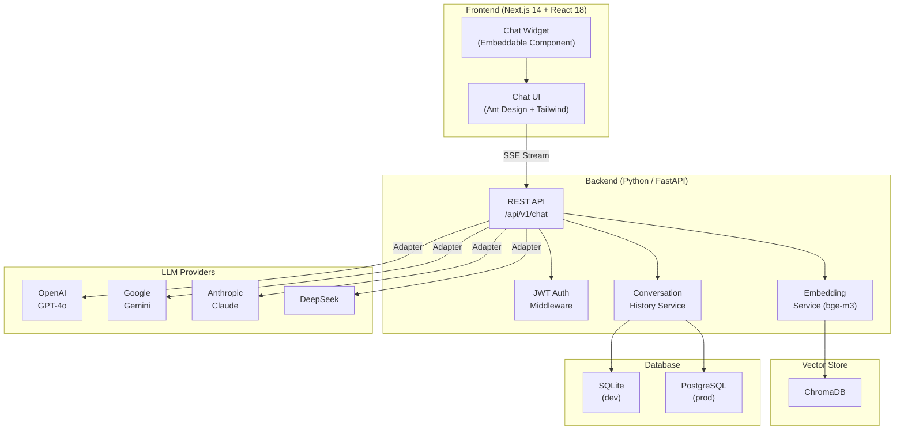

<div align="center">
  
</div>

<div align="center">

[](https://nodejs.org)
[](https://react.dev)
[](https://www.typescriptlang.org)
[](https://python.org)
[](https://nextjs.org)
[](./LICENSE)

</div>

---

## 🤖 Overview

**AI ChatKit** is a production-ready, full-stack AI chat framework that lets you drop a fully featured chat interface into any application in minutes. It abstracts away provider-specific API quirks — streaming protocols, token limits, tool-call formats — behind a single clean interface so your team ships features instead of glue code.

> **Problem it solves:** Every team building with LLMs rewrites the same boilerplate — provider adapters, SSE streaming, conversation history, auth, and embeddings. AI ChatKit is that solved layer, plug-and-play out of the box.

---

## ✨ Features

| Feature | Description |
|---|---|
| 🔌 **Multi-Provider LLM Support** | Switch between OpenAI, Google Gemini, Anthropic Claude, DeepSeek, and Qwen with a single env var |
| ⚡ **Streaming Responses** | Real-time token streaming via Server-Sent Events (SSE) — zero polling |
| 🧠 **Conversation History** | Persistent, multi-turn conversation storage with SQLite or PostgreSQL |
| 🏢 **Multi-Tenant Architecture** | Isolated sessions and API keys per workspace or user |
| 🔗 **REST API** | Clean, documented REST endpoints — integrate with any frontend or service |
| 🪄 **Embeddable Widget** | Drop the React component into any existing app with a single import |
| 📚 **RAG-Ready** | ChromaDB vector store integration with bge-m3 multilingual embeddings |
| 🔒 **JWT Auth** | Stateless authentication baked in from day one |

---

## 🏗️ Architecture



---

## 🚀 Quick Start

### Prerequisites

- Python 3.11+
- Node.js 20+
- [uv](https://github.com/astral-sh/uv) (Python package manager)

### 1. Clone the repository

```bash
git clone https://github.com/Raphasha27/ai-chatkit.git
cd ai-chatkit
```

### 2. Backend setup

```bash
cd backend

# Install dependencies via uv
uv sync

# Copy and configure environment variables
cp .env.example .env
# Edit .env — set LLM_PROVIDER and the matching API key

# Start the development server
uv run uvicorn app.main:app --reload --port 8000
```

The API will be available at `http://localhost:8000`.

### 3. Frontend setup

```bash
cd frontend

# Install dependencies
npm install

# Copy and configure environment variables
cp .env.example .env.local
# Edit .env.local — set NEXT_PUBLIC_API_URL=http://localhost:8000

# Start the development server
npm run dev
```

The chat UI will be available at `http://localhost:3000`.

---

## ⚙️ Environment Variables

Configure the root `.env` (or `backend/.env`) using the table below. Copy `.env.example` as your starting point — **never commit real secrets**.

| Variable | Required | Default | Description |
|---|---|---|---|
| `PORT` | ✅ | `8000` | Port the backend API listens on |
| `LLM_PROVIDER` | ✅ | `openai` | Active LLM provider: `openai` \| `gemini` \| `anthropic` \| `deepseek` \| `dashscope` |
| `OPENAI_API_KEY` | ✴️ | — | OpenAI API key (required when `LLM_PROVIDER=openai`) |
| `GEMINI_API_KEY` | ✴️ | — | Google Gemini API key (required when `LLM_PROVIDER=gemini`) |
| `ANTHROPIC_API_KEY` | ✴️ | — | Anthropic API key (required when `LLM_PROVIDER=anthropic`) |
| `JWT_SECRET` | ✅ | — | Secret used to sign JWT tokens — generate with `openssl rand -hex 32` |
| `DATABASE_URL` | ✅ | `sqlite+aiosqlite:///resource/database.db` | SQLAlchemy async database connection string |
| `EMBEDDING_MODEL` | ❌ | `bge-m3` | Ollama embedding model for RAG features |
| `CHROMA_PATH` | ❌ | `resource/chroma_db` | Relative path for ChromaDB persistence |
| `DEBUG` | ❌ | `false` | Enable verbose debug logging |

> ✴️ Only the key matching the active `LLM_PROVIDER` is required.

---

## 🗺️ Roadmap

- [x] Unified provider adapter layer (OpenAI, Gemini, Anthropic, DeepSeek, Qwen)
- [x] SSE streaming responses
- [x] Persistent conversation history (SQLite + PostgreSQL)
- [x] JWT authentication middleware
- [x] ChromaDB + bge-m3 embedding integration
- [x] Next.js 14 + Ant Design chat UI
- [ ] Built-in RAG pipeline with document upload
- [ ] Embeddable `<ChatWidget />` npm package
- [ ] OpenAPI / Swagger documentation endpoint
- [ ] WebSocket transport option (alongside SSE)
- [ ] Admin dashboard for conversation analytics
- [ ] One-click Vercel + Railway deployment templates
- [ ] MCP (Model Context Protocol) tool integration

---

## 🤝 Contributing

Contributions, issues, and feature requests are welcome!  
See [CONTRIBUTING.md](./CONTRIBUTING.md) for guidelines and [CODE_OF_CONDUCT.md](./CODE_OF_CONDUCT.md) for community standards.

---

## 🔐 Security

Found a vulnerability? Please read [SECURITY.md](./SECURITY.md) before disclosing publicly.

---

## 📄 License

This project is licensed under the **MIT License** — see [LICENSE](./LICENSE) for details.

---

<div align="center">
  <sub>Built with ❤️ by <strong>Koketso Raphasha</strong> · © 2026 <strong>Kirov Dynamics Technology</strong></sub>
  <br/>
  
</div>
