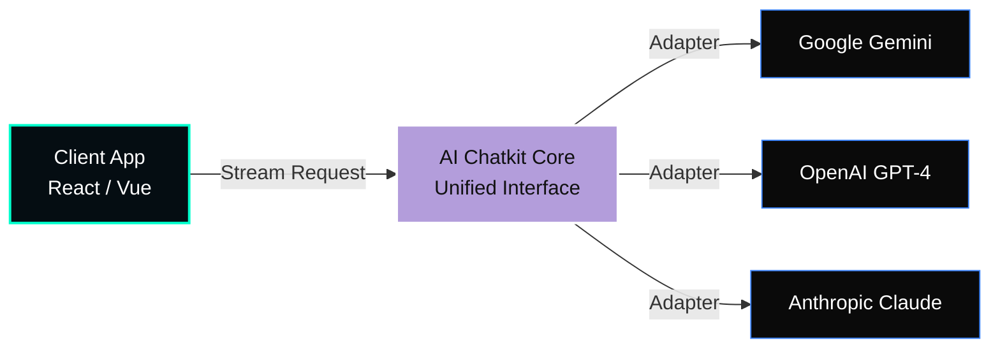

<div align="center">
  

  [](#)
  [](#)
</div>

## 🤖 Overview
**ai-chatkit** is an extensible AI chat toolkit designed for the rapid integration of advanced LLMs (like Gemini, Claude, and OpenAI) into enterprise applications. It bridges the gap between raw LLM APIs and production-ready chat interfaces.

---

## 📐 System Architecture Demo

The toolkit provides a standardized interface for message history, streaming, and tool execution across different AI providers.



### ⚡ Core Capabilities
1. **Unified Streaming:** Handle Server-Sent Events (SSE) from any provider with a single API.
2. **Tool Orchestration:** Easily map local functions to LLM tool calls.
3. **Memory Management:** Built-in adapters for vector stores and conversational history.

---

## 🛠️ Usage Example

```javascript
import { ChatClient } from 'ai-chatkit';

const chat = new ChatClient({ provider: 'gemini' });

await chat.sendMessage("Analyze the system architecture", {
  onStream: (chunk) => console.log(chunk),
  tools: [searchDocs]
});
```

## 🗺️ Roadmap
- [x] Standardize Provider Adapters.
- [x] Add Architectural Diagrams.
- [ ] Add built-in RAG (Retrieval-Augmented Generation) helpers.

---
**Innovative. Performant. Sovereign.**
*Built by Koketso Raphasha (Raphasha27)*
